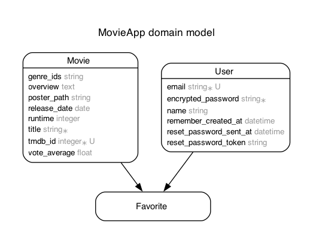

# MovieApp

TMDB（The Movie Database）APIを使った映画検索・お気に入り管理アプリです！

## 作成した背景
少しの暇な時間がある時に、空き時間に合わせた映画を検索できるものがアプリが欲しかったため、このアプリを作成しました。
また短編映画の気分だったり長編映画の気分など、その日の気分に合わせて上映時間から映画が検索できると良いと思い、追加機能として評価順や公開日順での並び替えも実装を行いました。

## 主な機能

- 映画の検索（上映時間で絞り込み、評価・公開日順で並び替え）
- 映画の詳細表示
- ユーザー登録・ログイン（ゲストログイン対応）
- お気に入り登録・解除
- お気に入り映画一覧表示

## ER図



## 技術スタック

- Ruby on Rails 6.1.7.7
- PostgreSQL
- TMDB API
- Devise（ユーザー認証）
- Bootstrap（フロントエンド）
- RSpec（テスト）

## 開発環境セットアップ

### 1. 必要なソフトウェア

- Ruby 3.2.0
- Rails 6.1.7.7
- PostgreSQL
- Node.js / Yarn
- Chrome / Chromedriver（systemテスト用）

### 2. セットアップ手順

```sh
git clone https://github.com/yoshiki44/Movie_app.git
cd Movie_app
bundle install
yarn install
rails db:create db:migrate
